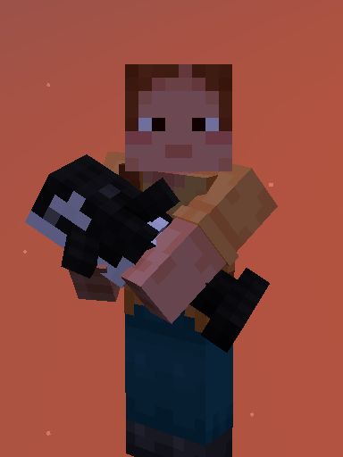
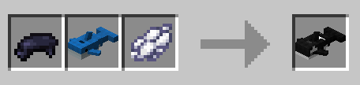
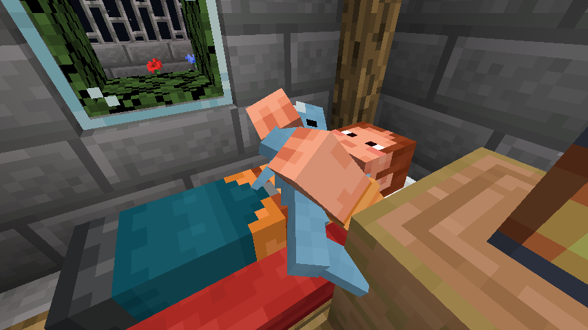

This is the RecraftorsMC port of the [BLAHAJ](https://github.com/Hibiii/Blahaj)
mod for [Quilt](https://quiltmc.org)

---

# Blåhaj

A Minecraft mod that adds the IKEA BLÅHAJ Soft toy shark and a giant bread pillow as items.

| Item             | Preview                                                           | Recipe                                                                      |
|------------------|-------------------------------------------------------------------|-----------------------------------------------------------------------------|
| Soft Toy Shark   |    |        |
| Gray Toy Shark   |    |    |
| Pink Toy Shark   |   |  |
| Bread Pillow     |         |       |
| Blue Whale toy   |    |     |
| Killer Whale toy |  |        |
| Seal soft toy    |          |                     |

## Extra features

### Sleeping cuddles!

| Seen from outside                                  | In first-player vision                            |
|----------------------------------------------------|---------------------------------------------------|
|  |  |

### G@-1$fa3%?;

A feature has secretly made its way into the mod, but does not wish to be found out.
It is out there, but will not make it easy to obtain it.

## Experimental features

<b>Blavingad contained use</b>

This feature allows you to use items in your world from inside a container plushie, much like the Blavingad.

As it stands, when enabled, this feature allows you to throw potions and use totems much like in vanilla, but
from the blavingad.

However! This feature is highly unstable and it is unrecommended to use with other items until certified as
working properly! Hence, it is restrained to a definite item tag `blahaj:blavingad_usable`, and restrained
by the `blahaj.contained.enable_use` gamerule, which by default is `false`.

While certified to work fine with vanilla totems and both splash and lingering potions, it is not
guaranteed that adding other items to the tag will work. It is therefore recommended to make backups before
testing anything risky!

# Builtin Compatibilities

## [Trinkets](https://github.com/emilyalexandra/trinkets)

Plushies can be worn in multiple Trinket slots! Each with their own rendering!

## [Traveler's Backpack](https://modrinth.com/mod/travelersbackpack)

Now with a custom additional backpack! (no special ability though)

## [Not Enough Animations](https://modrinth.com/mod/not-enough-animations)

Sleeping cuddle pose and item cuddling works despite the Not Enough Animations' "no sleeping item" setting.

This does not force the setting or temporarily changes it! The setting is only ignored for plushies

## [Immersive Melodies](https://modrinth.com/mod/immersive-melodies)

_Only available in 1.20.1 to this day_

Adds a brand-new instrument when Immersive Melodies is loaded.

<b>Recipe and showcase</b>

[Showcase video](https://www.youtube.com/watch?v=_z-3QsTLTgU)

---

# License

As a great part of this port's code has been rewritten over the course of its evolution, the latter is
now licensed under the [GPL-3.0](LICENSE) license, as a matter of protection over the provided work.

The original mod is licensed under the [Unlicense](https://github.com/Hibiii/Blahaj/LICENSE).
Feel free to learn from it, and incorporate it in your own projects.

The icon of this project is the Blobhaj by [Heatherhorns](https://www.weasyl.com/~heatherhorns),
and is licensed under a [Creative Commons Attribution 4.0 International License](http://creativecommons.org/licenses/by/4.0/).
